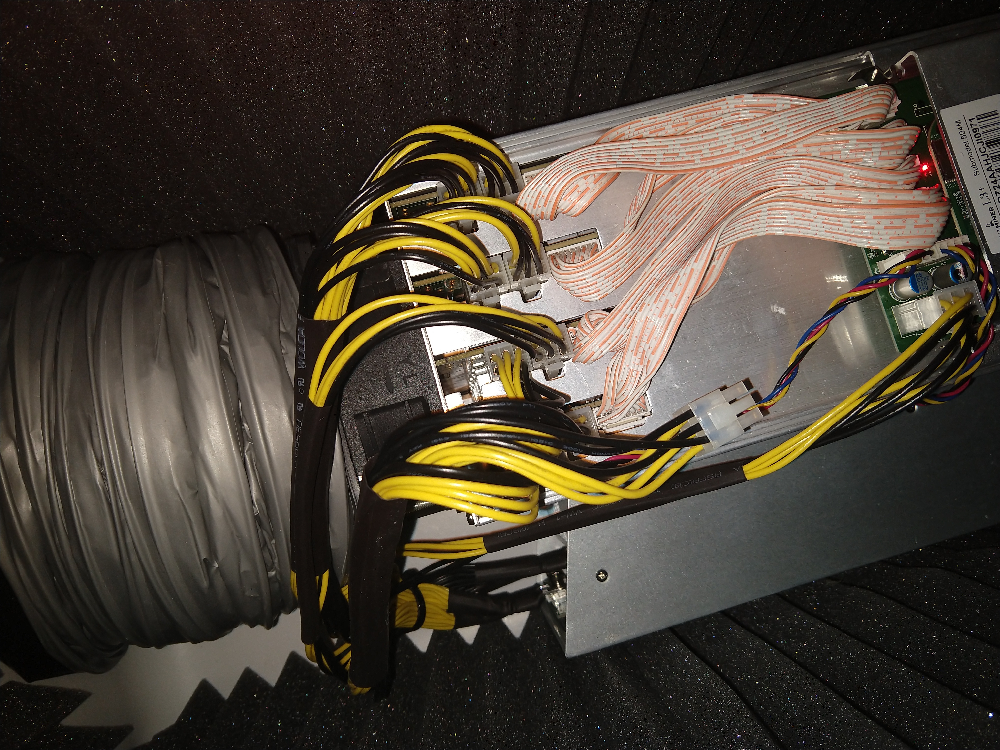
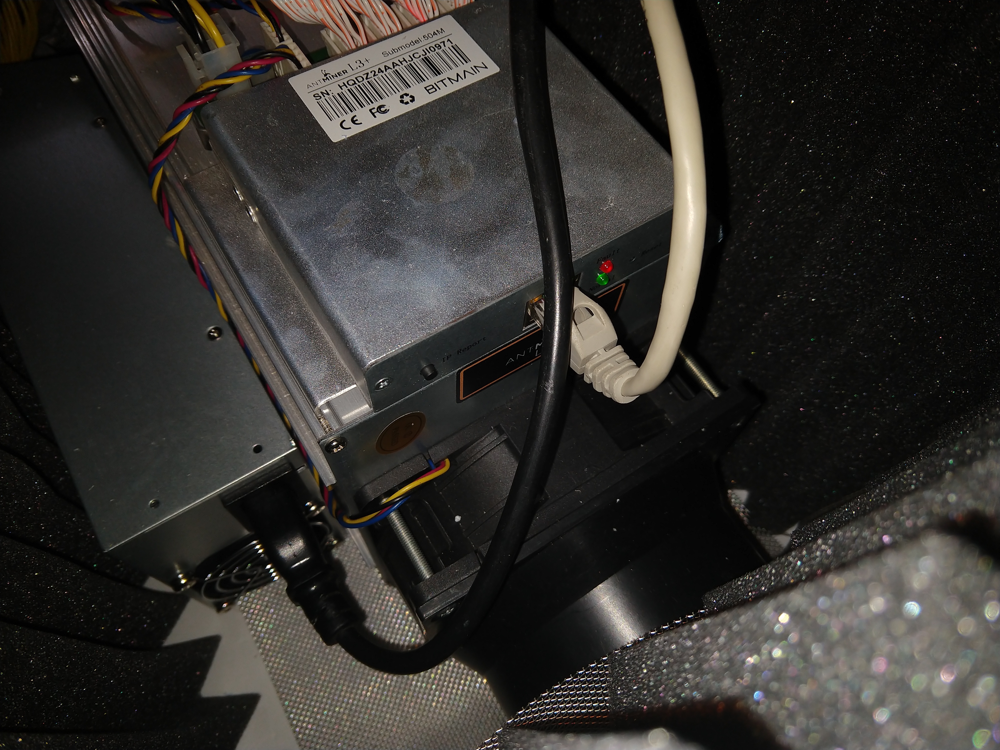
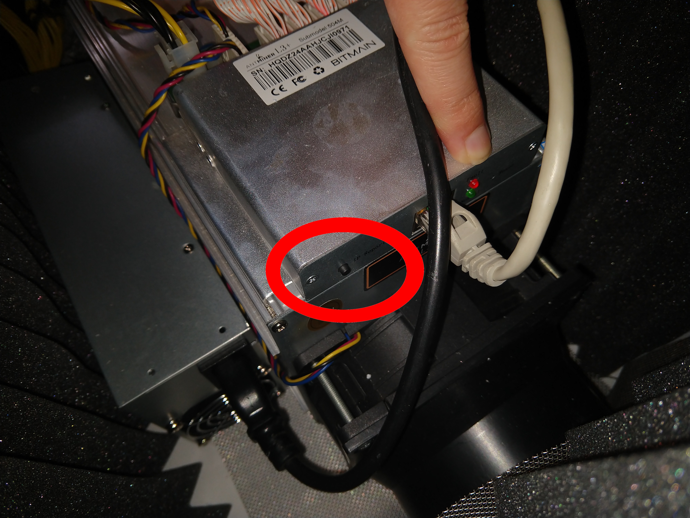
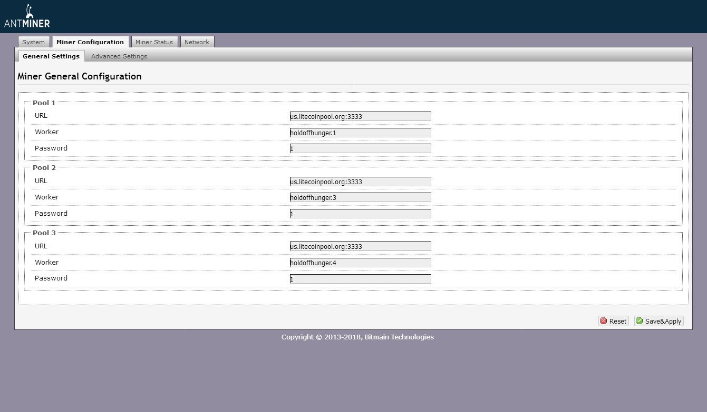
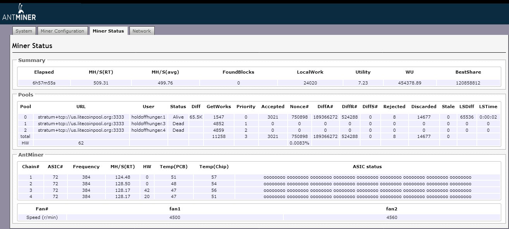

# Home Heating System with a CryptoCurrency Miner

This guide will show you everything you need to know in order to leverage a cryptocurrency miner as an efficient, electrical home-heating source, including how to build a silencing container for the miner.  Heat, comfort, quiet, and free digital currency, all right here.

## Introduction

In this guide, I'll show you how to setup a cryptocurrency miner, how to harvest its heat as an indoor, electrical heater, and how to cash out your cryptocurrency into cold, hard cash.

You could vary this setup as desired, but for the purposes of this guide, we'll be using :

* Miner : Antminer L3+
* CryptoCurrency : Litecoin
* CryptoAlgorithm : Scrypt
* Mining Pool : LiteCoinPool.org
* Crypto Wallet/Trader : kraken.com

## TOC

1. [Introduction](#introduction)
2. [TOC](#toc)
3. [Disclaimer](#disclaimer)
4. [Miner Assembly](#miner-assembly)
5. [Noise-Case assembly](#noise-case-assembly)
6. [Setup Mining](#setup-mining)
7. [Setup Cash Deposits](#setup-cash-deposits)

## Disclaimer

Please read the safety directions on all equipment that you have purchased or are using for this project.  I assume no responsibilyt or liability for damages you may incur in this proect.  Please read the licensing of this project before proceeding.

## Miner Assembly

### Parts

You will need the following parts :

* Power: AntMiner Power Supply APW3++
* Miner: AntMiner L3+ ASIC Litecoin Miner
* Cabling:
** Computer Power Cable
** Ethernet Cable

### Assembly

Asemble the AntMiner as follows :

* Attach a power cable to each of the power cable slots on the antminer.

* Attach an ethernet cable between the antminer and a router with internet connectivity.

* Attach the power cable to the antminer power supply and to an electrical outlet.

## Noise-Case Assembly

### Parts

* AntMiner 120mm Fan Duct cooling Shroud to 4 Inch Vent Hose
* 120mm Hole-Saw and Drill
* Duct Silencer Air-Duct for Inline Duct Fan
* Duct Clamp, 5 inch, stainless steel, 120-140mm
* Acoustic Foam Panels for Soundproofing
* Gorilla Glue, Super Glue Gel
* 12x8 Stainless Steel Woven Wire, 20 Mesh
* Coleman Performance Cooler, 48-Quart
* 1.25 Inch-Diameter Boring Drill Bit

### Assembly

* With the Hole-Saw and Drill, excavate two, relatively-centered holes at opposite sides of the Coleman cooler.  You should check to see that when placed inside, the antminer will be able to take intake air from one hole and send warm air out the exhaust.

* In the back of the cooler, drill a small hole for power and ethernet cabling, using the 1.25 inch-diameter boring drill bit.

* Using a screw driver, remove the metal grill(s) from either or both ends of the antminer, and in their place, attach the 120mm AntMiner Fan Ducts.

* Cut the duct silencer air-duct down to about 4-inches in width when in maximally compressed.  Attach the duct silencer air-duct to the AntMiner's exhaust fan (not the intake fan), and seal it using the duct clamp.

* Attach the soundproofing panels using gorilla glue gel in the cooler.  Make sure to attach one below the lid, as well.  You will probably need to resize these, so have a pair of scissors available.  Let the glue set for a few hours before proceeding.

* Place the antminer into the cooler, making sure to manually compress the duct silencer air duct, so that the entire device rests flat on its bottom in the cooler.

* Attach the power and networking cables through the 1.25 inch hole bored through with the drill bit.

* Use the stainless steel woven wire as a cover for the intake air.

* If you still have the metal grill from the third step up above, reattached it to the outside of the cooler using a drill.

## Setup Mining

### Mining Pool

You're going to need a mining pool, if you want a regular, reliable coinflow.  These reward miners based on their contributions, often before the actual blocks granting cryptocurrency tokens have been unlocked.  Instead of waiting a year for one single coin, which may be worth hundreds, it's considered more useful to get 0.01 or so of a token per day.

* Create an account at litecoinpool.org.

* On the help page at litecoinpool.org, select the server closest to you and keep this information handy.

### Networking

* Download the IP Reporter from Bitmain, here https://service.bitmain.com/support/download?product=IP-reporter

* Run the IP reporter.

* Power on the antminer.

* On the antminer itself, near the networking cable ports, there should be a small button.  Press it, and a small light with light up.

* On the computer running IP reporter, you should have a message indicating the miner's IP address.

### Configuration

* In a browser, visit the URL you were given by the IP Reporter.

* If you are prompted for a username and password, try "root" as both username and password.

* On the "Miner Configuration" page, fill in three pool section forms.  For each set the Password as "1" and set the URL as the litecoinpool.org URL you found up above, which should look like "us.litecoinpool.org:3333".

* For Pool 1, set the worker as "YourUserName.1", for Pool 2 as "YourUserName.2", and so on.

* Click save and wait a minute for the miner to begin mining.  You'll know it's mining by looing at the Miner Status page and seeing the connections.

## Setup Cash Deposits

### Wallet Setup

A wallet is an address for holding your digital cryptocurrency.  From this alone, you can spend your cryptocurrency.  These can be locally installed on your computer, but it's recommended you use an online one that is retrievable in case your computer dies.

More than that, wallets can provide other features, and probably the one most desired is: being able to cash out any digital currency, at its current market price, into cash in your bank account.

* Setup an account at kraken.com.

* Go through the verification process.

* On the "Funding" page, search for litecoin, and select the Deposit option.

* Select "Generate New Address".  This will give you a new public key for litecoin deposits, it should begin with an L.

* On the account page of litecoinpool.org, set payment address to the address you made with "Generate New Address".  This will cause the litecoinpool.org coins to go directly into your kraken account.

* When you're ready to cash out, select "Funding" at kraken.com, select USD, British Pound, Euro, or whatever currency you want, click "Withdraw", and then fill in your bank account details.

As simple as that.
